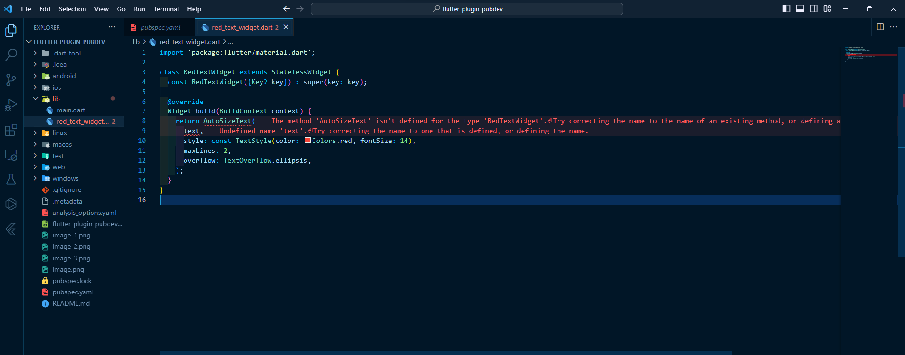

# <b>Laporan Pertemuan 9 - Praktikum Menerapkan Plugin di Project Flutter</b>
<b> Nama: Elang Putra Adam

Kelas: TI 3G

NIM: 2141720074 </b>

## <b>Praktikum: Menerapkan Plugin di Project Flutter</b>

Selesaikan langkah-langkah praktikum berikut ini menggunakan editor Visual Studio Code (VS Code) atau Android Studio atau code editor lain kesukaan Anda.

### <b>Langkah 1: Buat Project Baru</b>

Buatlah sebuah project flutter baru dengan nama flutter_plugin_pubdev. Lalu jadikan repository di GitHub Anda dengan nama flutter_plugin_pubdev.

<b>Jawab:</b>

### <b>Langkah 2: Menambahkan Plugin</b>

Tambahkan plugin auto_size_text menggunakan perintah berikut di terminal

    flutter pub add auto_size_text

<b>Jawab:</b>

### <b>Langkah 3: Buat file red_text_widget.dart</b>

Buat file baru bernama red_text_widget.dart di dalam folder lib lalu isi kode seperti berikut.

import 'package:flutter/material.dart';

    class RedTextWidget extends StatelessWidget {
    const RedTextWidget({Key? key}) : super(key: key);

    @override
    Widget build(BuildContext context) {
        return Container();
    }
    }

<b>Jawab:</b>

### <b>Langkah 4: Tambah Widget AutoSizeText</b>

Masih di file red_text_widget.dart, untuk menggunakan plugin auto_size_text, ubahlah kode return Container() menjadi seperti berikut.

    return AutoSizeText(
        text,
        style: const TextStyle(color: Colors.red, fontSize: 14),
        maxLines: 2,
        overflow: TextOverflow.ellipsis,
    );

Setelah Anda menambahkan kode di atas, Anda akan mendapatkan info error. Mengapa demikian? Jelaskan dalam laporan praktikum Anda!

<b>Jawab:</b>

Pada kode diatas terjadi error karena variabel text belum didefinisikan dan belum melakukan import untuk package auto_size_text.

### <b>Langkah 5: Buat Variabel text dan parameter di constructor</b>

Tambahkan variabel text dan parameter di constructor seperti berikut.

    final String text;

    const RedTextWidget({Key? key, required this.text}) : super(key: key);

<b>Jawab:</b>

### <b>Langkah 6: Tambahkan widget di main.dart</b>

Buka file main.dart lalu tambahkan di dalam children: pada class _MyHomePageState

    Container(
    color: Colors.yellowAccent,
    width: 50,
    child: const RedTextWidget(
                text: 'You have pushed the button this many times:',
            ),
    ),
    Container(
        color: Colors.greenAccent,
        width: 100,
        child: const Text(
            'You have pushed the button this many times:',
            ),
    ),

Run aplikasi tersebut dengan tekan F5, maka hasilnya akan seperti berikut.

<b>Jawab:</b>

Hasil running:

## <b>Praktikum: Tugas Praktikum</b>

1. Selesaikan Praktikum tersebut, lalu dokumentasikan dan push ke repository Anda berupa screenshot hasil pekerjaan beserta penjelasannya di file README.md!

<b>Jawab:</b>

Dokumentasi praktikum ada pada gambar diatas.

2. Jelaskan maksud dari langkah 2 pada praktikum tersebut!

<b>Jawab:</b>

Pada langkah 2, potongan kode tersebut digunakan untuk melakukan penambahan plugin auto_size_text ke dalam project flutter yang telah dibuat. plugin ini digunakan untuk mengatur ukuran teks secara otomatis sesuai dengan ruang yang tersedia pada widget.

3. Jelaskan maksud dari langkah 5 pada praktikum tersebut!

<b>Jawab:</b>

Pada langkah 5, melakukan pendefinisian variabel text dengan tipe String untuk menanggulangi error yang terjadi pada langkah 4 (tidak ada pendefinisian variabel text). Untuk baris kedua adalah deklarasi widget RedTextWidget. Kode ini digunakan untuk menginisialisasi widget dan menerima parameter yang dibutuhkan,

4. Pada langkah 6 terdapat dua widget yang ditambahkan, jelaskan fungsi dan perbedaannya!

<b>Jawab:</b>

pada widget RedTextWidget(), program akan menggunakan class RedTextWidget() yang telah dibuat pada langkah sebelumnya dengan ketentuan-ketentuan dan desain yang telah dibuat pada class RedTextWidget() pada file red_text_widget.dart. Sedangkan untuk widget Text() ,akan menampilkan text dengan container hijau dan text default tanpa perubahan.

5. Jelaskan maksud dari tiap parameter yang ada di dalam plugin auto_size_text berdasarkan tautan pada dokumentasi ini !

<b>Jawab:</b>

a. key*

digunakan untuk mengontrol bagaimana satu widget menggantikan widget lain.

b. textKey

digunakan untuk menetapkan kunci widget teks yang dihasilkan

c. style*

Jika bukan null, gaya yang digunakan untuk teks yang akan ditampilkan.

d. minFontSize

Batasan ukuran teks minimum yang akan digunakan saat mengubah ukuran teks secara otomatis. Diabaikan jika presetFontSizes disetel.

e. maxFontSize

Batasan ukuran teks maksimum yang akan digunakan saat mengubah ukuran teks secara otomatis.Diabaikan jika presetFontSizes disetel.

f. stepGranularity

mengontrol seberapa besar langkah perubahan ukuran teks yang akan diterapkan saat teks disesuaikan secara otomatis.

g. presetFontSizes

memberikan daftar ukuran font yang sudah ditentukan sebelumnya yang akan digunakan dalam proses penyesuaian otomatis ukuran teks. 

h. group

mengelompokkan beberapa AutoSizeText bersama dalam satu kelompok.

i. textAlign*

 mengatur perataan (alignment) teks dalam sebuah widget AutoSizeText. Properti ini menentukan bagaimana teks akan diatur di dalam kotak yang mengelilinginya.

j. textDirection*

properti yang digunakan dalam widget AutoSizeText di Flutter untuk mengatur arah teks (text direction). 

k. locale*

mengatur preferensi bahasa dan wilayah (locale) yang akan memengaruhi cara teks ditampilkan. Penggunaan locale memungkinkan untuk menentukan aturan pemformatan, tanda baca, dan konvensi penulisan yang sesuai dengan bahasa dan wilayah tertentu.

l. softWrap*

mengontrol apakah teks dalam widget harus memungkinkan pemisahan baris (line breaks) secara otomatis saat mencapai batas widget atau harus mengabaikannya dan hanya menampilkan sebanyak yang mungkin tanpa pemisahan baris.

m. wrapWords

memastikan apakah kata kata yang tidak dimuat dalam satu baris harus dibungkus, defaultnya adalah true untuk berperilaku seperti teks.

n. overflow*

mengendalikan perilaku tampilan teks yang melebihi batas lebar widget. 

o. overflowReplacement

mengganti tampilan teks yang melebihi batas widget dengan widget pengganti (replacement widget) yang ditentukan.

p. textScaleFactor*

mengontrol faktor skala teks. Faktor skala teks ini memungkinkan untuk memperbesar atau memperkecil ukuran teks dalam widget AutoSizeText tanpa harus mengatur ukuran teks secara langsung.

q. maxLines

mengatur jumlah maksimum baris yang akan ditampilkan untuk teks dalam widget.

r. semanticsLabel*

Parameter yang digunakan untuk label semantik alternatif.

6. Kumpulkan laporan praktikum Anda berupa link repository GitHub ke spreadsheet yang telah disediakan!

<b>Jawab:</b>

Baik.